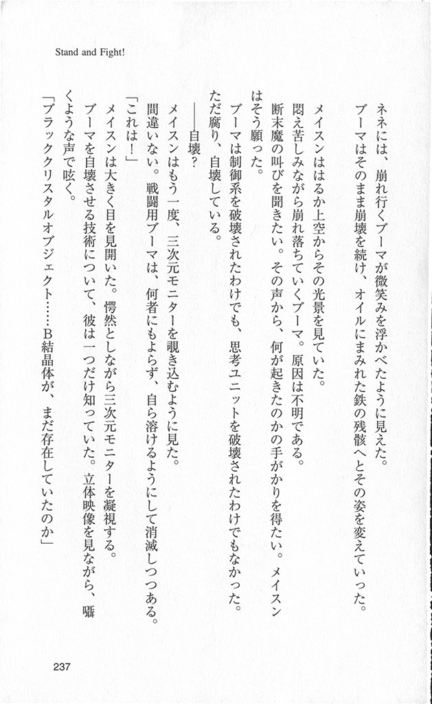

# CreepyTinyScanner

Простейший инструмент для помощи в сканировании книг. Я устал разрезать
страницы вручную и написал этот скрипт.

Скрипт принимает на входе каталог, в котором лежат сырые сканы. Из каждой
картинки он пытается извлечь прямоугольники, похожие на отдельные страницы
текста.

Особенности:

* Сканировать надо с чёрным фоном.
* Из одного скана можно получить много страниц.
* Сохраняем туда же, откуда берём исходники.
* Код написан максимально странно потому что, почему бы и нет.
* У скрипта только одна зависимость: opencv-python (какой-нибудь версии).
* Код был надёрган из интернетов, я понятия не имею как он вообще работает.
* Результат не идеален, предполагается, что всё-равно надо будет править руками.

Запуск:

```shell
python scanner.py /путь/до/папки/с/картинками
```

Ожидается на входе:


Получается на выходе:



